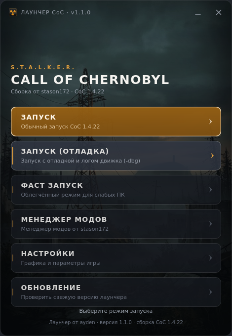

# Лаунчер для сборки S.T.A.L.K.E.R. Call of Chernobyl от stason172

<div align="center">


Лаунчер на **Python 3 + PySide6 (Qt 6)**: безрамочное окно с артом Зоны,
запуск игры в один клик, проверка файлов сборки и автосборка `.exe` в CI.



</div>

> Файлы игры в репозиторий не входят — лаунчер нужно положить в корневую папку
> уже установленной сборки. Скачать игру: [официальная группа в ВК](https://vk.com/scoc174).

## Установка

### Вариант 1 — готовый `.exe` (Python не нужен)

1. Откройте [последний релиз](https://github.com/ayonovdenizs/launcher-for-coc-by-stason172/releases/latest).
2. Скачайте `Launcher-CoC.exe` (при желании сверьте `SHA256SUMS.txt`).
3. Положите файл в корневую папку сборки — рядом со `Stalker-CoC.exe`.
4. Запустите лаунчер.

### Вариант 2 — из исходников

```bash
pip install -r requirements.txt
python launcher_coc.py
```

## Возможности

- **ЗАПУСК** — обычный запуск игры (`-skip_reg`)
- **ЗАПУСК (ОТЛАДКА)** — запуск с логом движка (`-skip_reg -dbg`)
- **ФАСТ ЗАПУСК** — облегчённый режим для слабых ПК (`CoC_1.4_02coreCPU.cmd`)
- **МЕНЕДЖЕР МОДОВ** и **НАСТРОЙКИ** — служебные утилиты сборки
- **ОБНОВЛЕНИЕ** — проверка свежего релиза через GitHub API; если версия новее,
  лаунчер подскажет об этом и откроет страницу загрузки
- Проверка файлов перед запуском (`Stalker-CoC.exe`, `gamedata/`) с понятными
  сообщениями об ошибках
- Логирование в `launcher.log` рядом с игрой
- Оформление: фоновый арт в стиле Зоны, своя иконка, плавные анимации кнопок,
  перетаскивание окна за заголовок, свернуть/закрыть, управление с клавиатуры
  (↑/↓ — навигация, Esc — выход)

Флаги командной строки: `--version` (показать версию), `--help`.
Переменная окружения `COC_NO_UPDATE_CHECK=1` отключает проверку обновлений
(полезно в офлайне).

## Разработка

### Структура

```
launcher_coc.py          точка входа (запускается и собирается в .exe)
launcher/
    app.py               создание QApplication, запуск окна
    paths.py             пути к игре и ресурсам, логирование
    options.py           таблица режимов запуска (кнопки меню)
    runner.py            сборка команды, проверки, запуск процесса
    updates.py           проверка релизов через GitHub API
    ui/
        main_window.py   окно лаунчера
        widgets.py       кнопки с анимацией
        theme.py         палитра, размеры, QSS
        update_check.py  фоновая проверка обновлений (QThread)
tools/
    make_assets.py       пересборка иконки и фона из исходников
    make_version_info.py ресурс версии для .exe
    preview_ui.py        скриншот окна без запуска игры
tests/                   pytest: логика, обновления, дымовые тесты UI
launcher.spec            PyInstaller-спецификация
```

### Команды

```bash
pip install -r requirements-dev.txt

ruff check .                  # линтер (в CI вместо flake8)
python -m pytest -q           # тесты
python tools/preview_ui.py --out build/ui-preview.png --hover 2   # превью интерфейса
```

### Сборка `.exe` локально

```bash
pip install -r requirements-dev.txt
python tools/make_version_info.py
pyinstaller launcher.spec --noconfirm --clean
```

Готовый файл — `dist/Launcher-CoC.exe` (onefile, без консоли, с иконкой
и ресурсом версии).

### Выпуск релиза

1. Обновите версию в `launcher/__init__.py` и добавьте раздел в `CHANGELOG.md`.
2. Закоммитьте изменения и поставьте тег: `git tag v1.1.1 && git push origin v1.1.1`.
3. Workflow [Release](.github/workflows/release.yml) соберёт `.exe`, посчитает
   `SHA256SUMS.txt` и создаст GitHub Release с описанием из `CHANGELOG.md`.

Каждый push и pull request также собирает `.exe` в артефактах (workflow **Build**)
и прогоняет линтер с тестами (workflow **CI**).

## Лицензия

MIT. S.T.A.L.K.E.R. — товарный знак GSC Game World; репозиторий не связан
с правообладателями и не содержит файлов игры.
