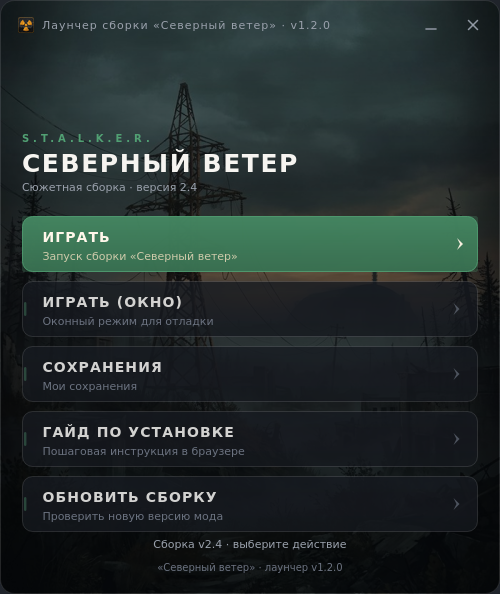

# Лаунчер для модов S.T.A.L.K.E.R. (CoC и другие)

<div align="center">


Один лаунчер для любых модов: что показывать и что запускать, описывает
файл **`config.launcher`** — код править не нужно.


</div>

> Файлы игры в репозиторий не входят — лаунчер нужно положить в корневую папку
> уже установленной сборки. Скачать игру: [официальная группа в ВК](https://vk.com/scoc174).

## Что это

Лаунчер на **Python 3 + PySide6 (Qt 6)**: безрамочное окно с артом Зоны, запуск
игры в один клик, проверка файлов сборки, открытие ссылок и папок, проверка
обновлений через GitHub — и, главное, **полная настройка конфигом**.

Один и тот же `Launcher-CoC.exe` обслуживает:

* сборку CoC от stason172 (файл `config.launcher` в корне репозитория);
* любой другой мод — пример в `examples/other-mod/config.launcher`
  (другое имя, цвет, кнопки, обязательные файлы).



## Быстрый старт

### Игроку

1. Скачайте из [последнего релиза](https://github.com/ayonovdenizs/launcher-for-coc-by-stason172/releases/latest)
   `Launcher-CoC.exe` **и** `config.launcher`
   ([прямые ссылки](https://github.com/ayonovdenizs/launcher-for-coc-by-stason172/releases/latest)).
2. Положите оба файла в корневую папку сборки — рядом со `Stalker-CoC.exe`.
3. Запустите лаунчер.

### Автору мода

1. Положите `Launcher.exe` в корень своей сборки.
2. Создайте заготовку конфига: `Launcher.exe --create-config`.
3. Заполните `config.launcher` под свой мод (комментарии с описанием полей уже
   внутри файла) и проверьте: `Launcher.exe --check-config`.

Минимальный конфиг выглядит так:

```jsonc
{
  "name": "Лаунчер мода «Северный ветер»",
  "accent": "#3f7d5a",
  "hero": { "title": "СЕВЕРНЫЙ ВЕТЕР", "subtitle": "версия 2.4" },
  "game": {
    "executable": "bin/xrEngine.exe",
    "required_files": ["bin/xrEngine.exe", "gamedata"]
  },
  "update": { "repo": "example-org/severny-veter" },
  "options": [
    { "title": "ИГРАТЬ", "args": "-nointro -x64", "accent": true },
    { "title": "СОХРАНЕНИЯ", "action": "folder", "path": "savedgames" },
    { "title": "ОБНОВИТЬ", "action": "update" }
  ]
}
```

Полное описание всех полей — **[docs/CONFIG.md](docs/CONFIG.md)**.
Живой пример с комментариями по каждому полю — [examples/other-mod/config.launcher](examples/other-mod/config.launcher).

### Что умеет конфиг

| Направление | Возможности |
| --- | --- |
| Окно | название, ширина, высота шапки, акцентный цвет, подпись внизу, своя иконка и фон |
| Шапка | надзаголовок, заголовок, подпись (любой пункт можно убрать) |
| Кнопки | любое количество в любом порядке: `run` (exe/cmd/bat + аргументы), `url` (ссылка), `folder` (сохранения, лог, `fsgame.ltx`), `update` (проверка релиза на GitHub) |
| Проверки | `required_files` для всей сборки и для отдельной кнопки; понятный список того, чего не хватает |
| Гибкость | `hide_if_missing` (не показывать кнопку, если файла нет), `keep_open` (оставить лаунчер открытым), `accent` (главная кнопка) |

Форматы: JSON с комментариями (`//`, `/* */`) и висячими запятыми; пути
относительно конфига, поддерживаются `~`, `%LOCALAPPDATA%`, `$HOME`.

Лаунчер работает **строго**: без корректного `config.launcher` он не стартует,
зато при ошибке показывает файл, строку, причину, подсказку и пример структуры,
а также предлагает «Создать пример» или «Открыть файл».

## Флаги командной строки

```bash
Launcher-CoC.exe                       # запустить лаунчер
Launcher-CoC.exe --check-config        # проверить config.launcher и выйти (годится для CI)
Launcher-CoC.exe --create-config       # создать образец конфига
Launcher-CoC.exe --config путь\config.launcher
Launcher-CoC.exe --version
```

Переменные окружения: `COC_NO_UPDATE_CHECK=1` — не обращаться к GitHub,
`COC_LAUNCHER_VERSION` — версия для сборок не из тега,
`COC_EXE_NAME` — имя `.exe` при сборке форком.

## Возможности лаунчера

- Запуск игры, отладочный запуск с логом движка, фаст-запуск для слабых ПК,
  менеджер модов, настройки игры — всё это просто кнопки из конфига.
- Проверка обязательных файлов перед запуском с перечислением того, чего не хватает.
- Открытие папок (сохранения, логи) и ссылок (группа мода, гайды).
- Проверка релиза через GitHub API в фоне: «Доступна версия X» и переход на страницу загрузки.
- Логирование в `launcher.log` рядом с игрой (включая предупреждения о непонятных полях конфига).
- Оформление: фон в стиле Зоны, своя иконка, плавные анимации, перетаскивание
  окна за заголовок, управление с клавиатуры (↑/↓ — навигация, Esc — выход).

## Разработка

### Структура

```
launcher_coc.py           точка входа (запускается и собирается в .exe)
config.launcher           рабочая настройка сборки CoC + справочник по полям
examples/other-mod/       пример настройки для стороннего мода
docs/CONFIG.md            полное описание формата config.launcher
launcher/
    app.py                аргументы командной строки, создание окна
    config.py             разбор и проверка config.launcher (JSONC)
    paths.py              пути к игре и ресурсам, логирование
    options.py            кнопка лаунчера и список действий
    runner.py             запуск файлов, открытие ссылок и папок
    updates.py            проверка релизов через GitHub API
    console.py            вывод UTF-8 в консоли Windows
    ui/
        main_window.py    окно лаунчера
        config_dialogs.py диалоги про отсутствующий/сломанный конфиг
        widgets.py        кнопки с анимацией
        theme.py          палитра, размеры, QSS (акцент из конфига)
        update_check.py   фоновая проверка обновлений (QThread)
tools/
    make_assets.py        пересборка иконки и фона из исходников
    make_version_info.py  ресурс версии для .exe
    preview_ui.py         скриншот окна без запуска игры
tests/                    pytest: конфиг, действия, обновления, дымовые тесты UI
launcher.spec             PyInstaller-спецификация
```

### Команды

```bash
pip install -r requirements-dev.txt

ruff check .                  # линтер (в CI вместо flake8)
python -m pytest -q           # 137 тестов: конфиг, действия, обновления, UI

# превью интерфейса для любого конфига
python tools/preview_ui.py --out build/ui-preview.png --hover 2
python tools/preview_ui.py --config examples/other-mod/config.launcher --out build/other.png
```

### Сборка `.exe` локально

```bash
pip install -r requirements-dev.txt
python tools/make_version_info.py
pyinstaller launcher.spec --noconfirm --clean
```

Готовый файл — `dist/Launcher-CoC.exe` (onefile, без консоли, с иконкой и
ресурсом версии). Имя сборки можно переопределить: `COC_EXE_NAME=MyModLauncher`.

### Выпуск релиза

1. Обновите версию в `launcher/__init__.py` и добавьте раздел в `CHANGELOG.md`.
2. Закоммитьте изменения и поставьте тег: `git tag v1.2.1 && git push origin v1.2.1`.
3. Workflow [Release](.github/workflows/release.yml) соберёт `.exe` вместе с
   `config.launcher`, посчитает `SHA256SUMS.txt` и создаст GitHub Release
   с описанием из `CHANGELOG.md`.

Каждый push и pull request собирает `.exe` в артефактах (workflow **Build**),
прогоняет линтер и тесты (workflow **CI**) и проверяет `config.launcher` из
репозитория через `--check-config`.

## Лицензия

MIT. S.T.A.L.K.E.R. — товарный знак GSC Game World; репозиторий не связан
с правообладателями и не содержит файлов игры.
